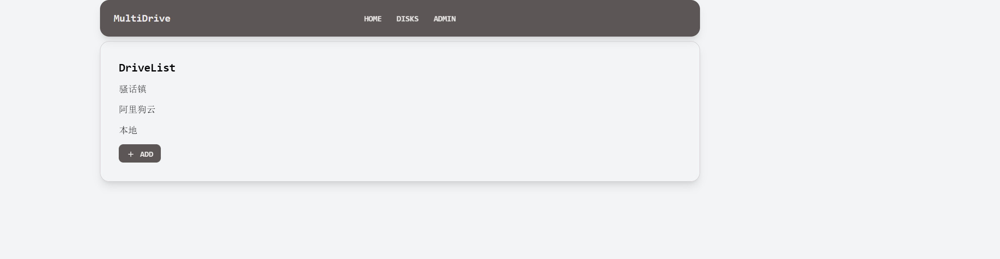
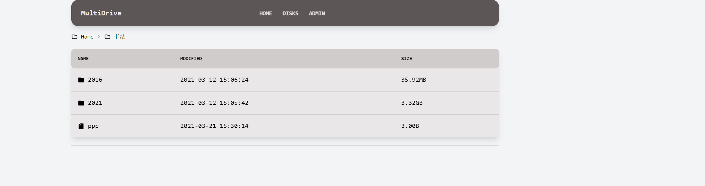
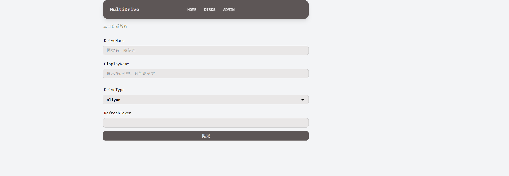
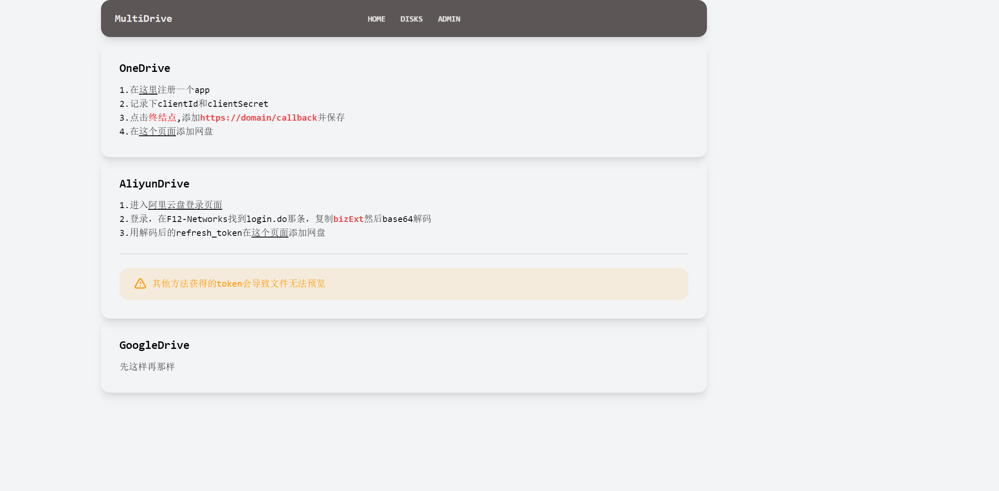

# 这是什么
MultiDrive是一款云盘管理程序，支持像oneindex那样列出云盘文件目录，提供基本的网盘管理功能。  
很多功能仍在开发...

# 功能
- [x] 自动刷新token
- [x] 文件直链下载
- [x] 渲染readme.md文件
- [x] 基本图片、文本、视频预览
- [x] Redis缓存，加快列表速度
- [x] 分享指定目录
- [x] 将部分格式的office文件转换为PDF

# 支持网盘
- [x] OneDrive
- [x] AliyunDrive
- [x] 本地存储
- [x] 百度网盘
- [ ] GoogleDrive
- [ ] FTP
- [ ] 七牛 / 又拍
- [ ] Oracle

# 安装方法
```shell
pip3 install -r requirements.txt
pip3 install uwsgi
```
```shell
uwsgi --http :8080 --chdir /path/to/your/MultiDrive -w multi.wsgi
```

# 截图






# TODO 
- [ ] 一个更好看的后台
- [ ] 文件上传
- [ ] 网盘搬家
- [ ] 在线编辑
- [ ] REST api
- [ ] 文件密码
- [ ] 离线下载
- [ ] 媒体播放器
- [ ] 一键部署脚本
- [ ] 文件中转站，类似于transfer.office.com
- [ ] 在线预览更多文件类型 
- [ ] 定时备份

# 开发状态
还在开发完善，熟悉Django的可以搭建起来尝尝鲜...

偶尔更新，逐步完善中

# 常见问题
> Q：目录突然空白，之前还是好的  
A：尝试在`/disks`刷新token，检查后台定时任务状态
